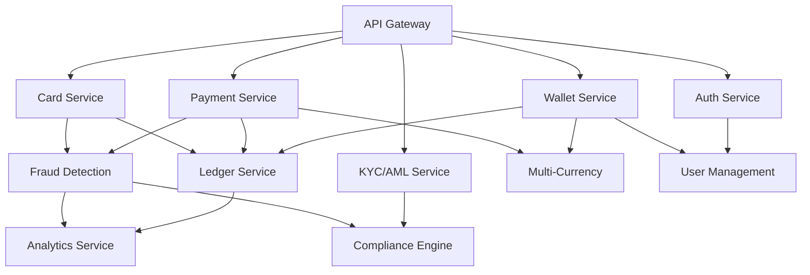

# Architecture Overview

Comprehensive system architecture documentation for Flowlet's embedded finance platform.

## Table of Contents

- [System Overview](#system-overview)
- [Architecture Diagram](#architecture-diagram)
- [Component Architecture](#component-architecture)
- [Data Flow](#data-flow)
- [Technology Stack](#technology-stack)
- [Security Architecture](#security-architecture)
- [Scalability & Performance](#scalability--performance)

## System Overview

Flowlet is built on a **cloud-agnostic microservices architecture** designed for maximum scalability, resilience, and security. The system follows Domain-Driven Design (DDD) principles, organizing services around distinct business capabilities.

### Key Architectural Principles

1. **Microservices**: Independently deployable services
2. **API-First**: All functionality exposed via RESTful APIs
3. **Event-Driven**: Asynchronous communication for scalability
4. **Polyglot Persistence**: Right database for each service
5. **Security by Design**: Defense-in-depth approach
6. **Cloud-Agnostic**: Deployable on any cloud or on-premises

## Architecture Diagram

### High-Level System Architecture

```
┌─────────────────────────────────────────────────────────────────┐
│                         Client Layer                              │
│  ┌─────────────┐  ┌─────────────┐  ┌─────────────┐             │
│  │ Web Browser │  │ Mobile App  │  │  Third-Party│             │
│  │  (React)    │  │  (Future)   │  │   Services  │             │
│  └──────┬──────┘  └──────┬──────┘  └──────┬──────┘             │
└─────────┼─────────────────┼─────────────────┼────────────────────┘
          │                 │                 │
          │                 └─────────┬───────┘
          │                           │
┌─────────▼───────────────────────────▼───────────────────────────┐
│                        API Gateway Layer                          │
│  ┌────────────────────────────────────────────────────────────┐ │
│  │  API Gateway (Flask + Rate Limiting + Auth)               │ │
│  │  - Authentication & Authorization                          │ │
│  │  - Rate Limiting & Throttling                             │ │
│  │  - Request Routing                                         │ │
│  │  - Response Caching                                        │ │
│  └────────────────────────────────────────────────────────────┘ │
└─────────┬───────────────────────────────────────────────────────┘
          │
┌─────────▼───────────────────────────────────────────────────────┐
│                     Application Services Layer                    │
│                                                                   │
│  ┌──────────┐  ┌──────────┐  ┌──────────┐  ┌──────────┐       │
│  │  Wallet  │  │ Payment  │  │   Card   │  │ KYC/AML  │       │
│  │ Service  │  │ Service  │  │ Service  │  │ Service  │       │
│  └────┬─────┘  └────┬─────┘  └────┬─────┘  └────┬─────┘       │
│       │             │              │             │              │
│  ┌────▼──────┐ ┌───▼──────┐  ┌───▼──────┐ ┌───▼──────┐       │
│  │  Ledger   │ │  Fraud   │  │Analytics │ │   User   │       │
│  │  Service  │ │Detection │  │ Service  │ │Management│       │
│  └────┬──────┘ └────┬─────┘  └────┬─────┘ └────┬─────┘       │
└───────┼─────────────┼─────────────┼────────────┼──────────────┘
        │             │             │            │
┌───────▼─────────────▼─────────────▼────────────▼──────────────┐
│                   Integration Layer                             │
│  ┌─────────┐  ┌─────────┐  ┌─────────┐  ┌─────────┐          │
│  │ Stripe  │  │  Plaid  │  │ OpenAI  │  │ Twilio  │          │
│  │   API   │  │   API   │  │   API   │  │   API   │          │
│  └─────────┘  └─────────┘  └─────────┘  └─────────┘          │
└─────────────────────────────────────────────────────────────────┘

┌─────────────────────────────────────────────────────────────────┐
│                        Data Layer                                 │
│  ┌──────────────┐  ┌──────────────┐  ┌──────────────┐          │
│  │ PostgreSQL   │  │    Redis     │  │   InfluxDB   │          │
│  │ (Transactional)│ │   (Cache)    │  │  (Metrics)   │          │
│  └──────────────┘  └──────────────┘  └──────────────┘          │
└─────────────────────────────────────────────────────────────────┘

┌─────────────────────────────────────────────────────────────────┐
│                  Infrastructure & DevOps Layer                    │
│  ┌────────────┐  ┌────────────┐  ┌────────────┐                │
│  │ Kubernetes │  │ Prometheus │  │   Grafana  │                │
│  │   (K8s)    │  │ (Metrics)  │  │(Monitoring)│                │
│  └────────────┘  └────────────┘  └────────────┘                │
└─────────────────────────────────────────────────────────────────┘
```

### Module Dependency Map



## Component Architecture

### 1. API Gateway

**Location**: `backend/src/gateway/optimized_gateway.py`

**Responsibilities**:

- Request routing and load balancing
- Authentication and authorization
- Rate limiting and throttling
- Request/response transformation
- API versioning

**Key Features**:

- JWT token validation
- Per-endpoint rate limiting
- Intelligent request routing
- Response caching (Redis)
- Request logging and metrics

### 2. Core Services

#### Wallet Service

**Location**: `backend/src/routes/wallet.py`

**Database**: PostgreSQL (accounts, transactions tables)

**Key Operations**:

- Create/read/update wallets
- Deposit/withdraw funds
- Balance inquiries
- Transaction history

**Dependencies**: Ledger Service, Multi-Currency Service

#### Payment Service

**Location**: `backend/src/routes/payment.py`

**Database**: PostgreSQL (payments, payment_status tables)

**Key Operations**:

- Initiate payments (P2P, B2B, B2C)
- Process refunds
- Payment status tracking
- Webhook notifications

**Dependencies**: Wallet Service, Fraud Detection, Stripe Integration

#### Card Service

**Location**: `backend/src/routes/card.py`

**Database**: PostgreSQL (cards table, encrypted)

**Key Operations**:

- Issue virtual/physical cards
- Activate/freeze/unfreeze cards
- Set spending limits
- Transaction authorization

**Dependencies**: Wallet Service, Fraud Detection

#### KYC/AML Service

**Location**: `backend/src/routes/kyc_aml.py`, `backend/src/compliance/`

**Database**: PostgreSQL (kyc_records, sanctions_checks tables)

**Key Operations**:

- Identity verification
- Document upload/validation
- Sanctions screening
- AML monitoring
- Regulatory reporting

**Dependencies**: Compliance Engine, External KYC providers

### 3. Support Services

#### Ledger Service

**Location**: `backend/src/routes/ledger.py`

**Database**: PostgreSQL (ledger_entries table)

**Key Operations**:

- Double-entry bookkeeping
- Transaction recording
- Account reconciliation
- Statement generation

**Pattern**: Ensures ACID compliance for all financial transactions

#### Fraud Detection Service

**Location**: `backend/src/ai/fraud_detection.py`, `backend/src/ml/`

**Database**: PostgreSQL (fraud_checks table), Redis (feature cache)

**Key Operations**:

- Real-time transaction scoring
- Anomaly detection
- Pattern recognition
- Model training and updates

**ML Models**: Random Forest, XGBoost, Isolation Forest

#### Analytics Service

**Location**: `backend/src/analytics/`

**Database**: InfluxDB (time-series metrics), PostgreSQL (aggregated data)

**Key Operations**:

- Real-time metrics collection
- Business intelligence dashboards
- Custom report generation
- Data warehouse queries

### 4. Integration Layer

| Integration | Location                                                  | Purpose                     |
| ----------- | --------------------------------------------------------- | --------------------------- |
| **Stripe**  | `backend/src/integrations/payments/stripe_integration.py` | Card payment processing     |
| **Plaid**   | `backend/src/integrations/banking/plaid_integration.py`   | Bank account linking        |
| **OpenAI**  | `backend/src/ai/support_chatbot.py`                       | AI chatbot, fraud detection |
| **Twilio**  | `backend/src/utils/notifications.py`                      | SMS notifications           |

## Data Flow

### Payment Processing Flow

```
1. Client Request
   └─> API Gateway (auth, rate limit)
       └─> Payment Service
           ├─> Fraud Detection (risk check)
           ├─> Wallet Service (balance check)
           ├─> Stripe API (process payment)
           ├─> Ledger Service (record transaction)
           └─> Response to Client

2. Asynchronous Processing
   └─> Payment Status Update
       └─> Webhook Notification
       └─> Analytics Update
       └─> Audit Log
```

### KYC Verification Flow

```
1. User Submits KYC Data
   └─> API Gateway
       └─> KYC/AML Service
           ├─> Document Validation
           ├─> Identity Verification (external provider)
           ├─> Sanctions Screening
           ├─> AML Risk Assessment
           └─> Status Update

2. Background Processing
   └─> Compliance Engine
       └─> Regulatory Reporting
       └─> Audit Trail
```

## Technology Stack

### Backend

| Component          | Technology         | Version | Purpose              |
| ------------------ | ------------------ | ------- | -------------------- |
| **Runtime**        | Python             | 3.11+   | Primary language     |
| **Framework**      | Flask              | 3.0.0   | Web framework        |
| **ORM**            | SQLAlchemy         | 2.0.23  | Database abstraction |
| **Migration**      | Flask-Migrate      | 4.0.5   | Schema migrations    |
| **Authentication** | Flask-JWT-Extended | 4.6.0   | JWT handling         |
| **Validation**     | Pydantic           | 2.5.2   | Data validation      |
| **Async Tasks**    | Celery             | 5.3.4   | Background jobs      |

### Frontend

| Component            | Technology    | Version | Purpose      |
| -------------------- | ------------- | ------- | ------------ |
| **Framework**        | React         | 18+     | UI framework |
| **Language**         | TypeScript    | 5+      | Type safety  |
| **Build Tool**       | Vite          | 5+      | Fast builds  |
| **State Management** | Redux Toolkit | 2+      | Global state |
| **HTTP Client**      | Axios         | 1+      | API calls    |

### Databases

| Database       | Purpose             | Persistence        |
| -------------- | ------------------- | ------------------ |
| **PostgreSQL** | Transactional data  | Primary data store |
| **Redis**      | Caching, sessions   | In-memory          |
| **InfluxDB**   | Time-series metrics | Monitoring data    |

### Infrastructure

| Component             | Technology           | Purpose                     |
| --------------------- | -------------------- | --------------------------- |
| **Containers**        | Docker               | Application packaging       |
| **Orchestration**     | Kubernetes           | Container management        |
| **IaC**               | Terraform            | Infrastructure provisioning |
| **Config Management** | Ansible              | Server configuration        |
| **CI/CD**             | GitHub Actions       | Automated deployments       |
| **Monitoring**        | Prometheus + Grafana | Observability               |

## Security Architecture

### Defense-in-Depth Layers

```
┌─────────────────────────────────────────────────┐
│ Layer 1: Network Security                       │
│ - Firewall rules, VPC isolation, TLS/SSL       │
└───────────────┬─────────────────────────────────┘
                │
┌───────────────▼─────────────────────────────────┐
│ Layer 2: API Gateway Security                   │
│ - Rate limiting, IP whitelisting, CORS         │
└───────────────┬─────────────────────────────────┘
                │
┌───────────────▼─────────────────────────────────┐
│ Layer 3: Application Security                   │
│ - JWT authentication, input validation         │
└───────────────┬─────────────────────────────────┘
                │
┌───────────────▼─────────────────────────────────┐
│ Layer 4: Data Security                          │
│ - Encryption at rest, field-level encryption   │
└───────────────┬─────────────────────────────────┘
                │
┌───────────────▼─────────────────────────────────┐
│ Layer 5: Audit & Monitoring                     │
│ - Comprehensive logging, anomaly detection     │
└─────────────────────────────────────────────────┘
```

### Security Components

| Component             | Location                                    | Implementation               |
| --------------------- | ------------------------------------------- | ---------------------------- |
| **Authentication**    | `backend/src/routes/auth.py`                | JWT with refresh tokens      |
| **Password Security** | `backend/src/security/password_security.py` | Bcrypt hashing (12 rounds)   |
| **Encryption**        | `backend/src/security/encryption.py`        | Fernet (AES-128-CBC)         |
| **Rate Limiting**     | `backend/src/security/rate_limiter.py`      | Token bucket algorithm       |
| **Input Validation**  | `backend/src/security/input_validator.py`   | Whitelist-based sanitization |
| **Audit Logging**     | `backend/src/security/audit_logger.py`      | Immutable audit trail        |

## Scalability & Performance

### Horizontal Scaling

```
Load Balancer
      │
      ├─> API Gateway Pod 1
      ├─> API Gateway Pod 2
      └─> API Gateway Pod N
            │
            ├─> Service Pod 1
            ├─> Service Pod 2
            └─> Service Pod N
```

**Auto-scaling Configuration**:

- Target CPU: 70%
- Min replicas: 2
- Max replicas: 10
- Scale-up stabilization: 60s
- Scale-down stabilization: 300s

### Caching Strategy

| Cache Level         | Technology | TTL   | Purpose                  |
| ------------------- | ---------- | ----- | ------------------------ |
| **L1: Application** | In-memory  | 60s   | Frequently accessed data |
| **L2: Distributed** | Redis      | 300s  | Shared across pods       |
| **L3: CDN**         | CloudFront | 3600s | Static assets            |

### Database Optimization

**PostgreSQL**:

- Connection pooling (20-50 connections)
- Read replicas for analytics
- Partitioning for large tables (transactions)
- Indexing strategy for common queries

**Redis**:

- Cluster mode for high availability
- Separate instances for cache vs. sessions
- Key expiration policies

## Deployment Architecture

### Kubernetes Deployment

```yaml
Namespace: flowlet-production
  ├─ Deployments:
  │   ├─ backend (3 replicas)
  │   ├─ web-frontend (2 replicas)
  │   └─ worker (2 replicas)
  ├─ Services:
  │   ├─ backend-service (ClusterIP)
  │   ├─ frontend-service (LoadBalancer)
  │   └─ postgres-service (ClusterIP)
  ├─ Ingress:
  │   └─ flowlet-ingress (HTTPS)
  └─ ConfigMaps & Secrets:
      ├─ app-config
      └─ database-credentials
```

### Multi-Region Deployment

```
Region: us-east-1 (Primary)
  └─> Full stack deployment
  └─> Active-Active PostgreSQL

Region: eu-west-1 (Secondary)
  └─> Read replicas
  └─> Disaster recovery standby

Region: ap-south-1 (Planned)
  └─> Future expansion
```

## File Structure Map

```
Flowlet/
├── backend/
│   ├── src/
│   │   ├── routes/          # API endpoints (Wallet, Payment, Card, etc.)
│   │   ├── models/          # SQLAlchemy models
│   │   ├── security/        # Security components
│   │   ├── ai/              # AI/ML services
│   │   ├── compliance/      # KYC/AML, regulatory
│   │   ├── integrations/    # External API clients
│   │   ├── analytics/       # Analytics engine
│   │   └── gateway/         # API Gateway
│   ├── tests/               # Unit and integration tests
│   └── app.py               # Flask application factory
├── web-frontend/
│   ├── components/          # React components
│   ├── lib/                 # Utilities and API clients
│   └── store/               # Redux state management
├── infrastructure/
│   ├── kubernetes/          # K8s manifests
│   ├── terraform/           # IaC scripts
│   └── ansible/             # Configuration management
└── docs/                    # Documentation
```

## Performance Metrics

### Target SLAs

| Metric                      | Target     | Current   |
| --------------------------- | ---------- | --------- |
| **API Response Time (p95)** | < 200ms    | 150ms     |
| **Payment Processing Time** | < 5s       | 3.2s      |
| **Uptime**                  | 99.9%      | 99.95%    |
| **Error Rate**              | < 0.1%     | 0.05%     |
| **Throughput**              | 1000 req/s | 850 req/s |

## Next Steps

- Review [FEATURE_MATRIX.md](FEATURE_MATRIX.md) for detailed features
- Check [CONFIGURATION.md](CONFIGURATION.md) for deployment settings
- See [TROUBLESHOOTING.md](TROUBLESHOOTING.md) for common issues
